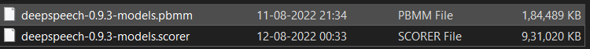
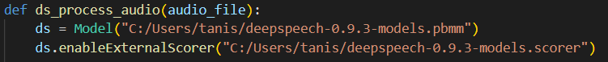
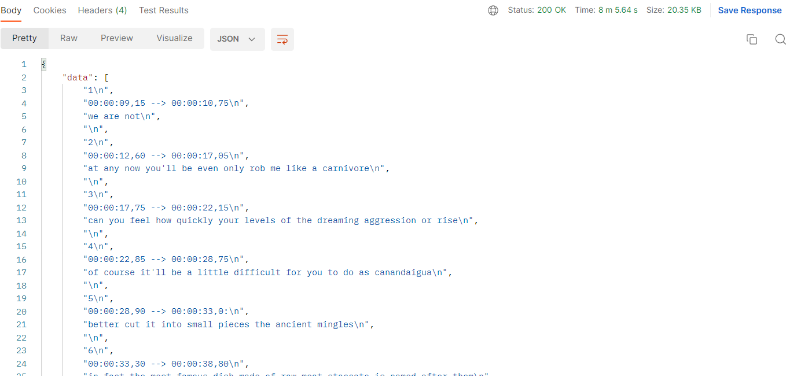

# transcriber_restful_api

The following API takes the video ID of the video you want to transcribe and provide you with the subtitles generated using the pre-trained model Deepspeech 
developed by Mozilla

## Deployment
### Dependencies
All the dependencies are mentioned in the requirements.txt file. In order to install it, change your directory to wherever the file is located and run
```
    pip install -r requirements.txt
```

After that you need the deepspeech trained model and the scorer model. To install them
```
    curl -LO https://github.com/mozilla/DeepSpeech/releases/download/v0.9.3/deepspeech-0.9.3-models.pbmm
    curl -LO https://github.com/mozilla/DeepSpeech/releases/download/v0.9.3/deepspeech-0.9.3-models.scorer
```
Locate the following files and copy the their location


and paste the location of the model and the scorer file here


### Running the API
1. Run the 'transcriber_api.py'
```
    python transcriber_api.py
```
2. Using Postman, send a get request to the localhost http://127.0.0.1:5000/ followed by the video id of the Youtube video


## Output

